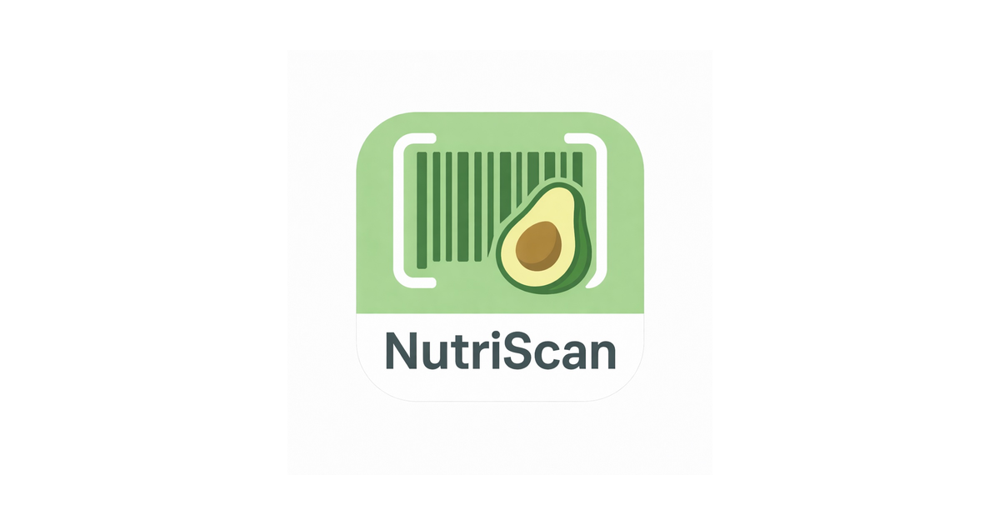

## 🍏 NutriScan — Smart Food Scanner & Recipe Creation

## 📱 Overview

NutriScan is an iOS application built entirely with SwiftUI, designed to scan food products, analyze their nutritional values, and recommend relevant recipes automatically.

The app combines the essential features of apps like Yuka (barcode scanning, product analysis) and Crouton (recipe browsing and creation) into a single, elegant experience.

## ✨ Features

- 📸 Scan food products using the device camera
- 📊 Retrieve nutritional data from OpenFoodFacts
- 📚 Store scan history for quick access
- 📝 Create and manage custom recipes
- 📱 Smooth and responsive SwiftUI interface

## 📦 Technologies Used

- SwiftUI — User interface
- AVFoundation — Barcode scanning
- URLSession — Networking
- Codable — JSON parsing
- Local Storage — Data persistence
- OpenFoodFacts API — Nutrition data
  
> [!IMPORTANT]
> NutriScan relies on third-party APIs for retrieving nutritional data. The accuracy and completeness of information depend on the OpenFoodFacts database. Always verify critical dietary information independently, especially in case of allergies or medical conditions.

## 🔏 Privacy

NutriScan respects your privacy and does not collect, store, or sell personal user data.

All scanned information and personal recipes are stored locally on the device. The app only connects to the internet to retrieve public food data from OpenFoodFacts.
